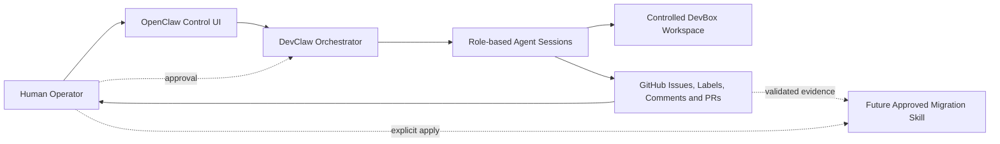

# Application Modernization Lab

**AI-agent-driven experiments for migrating multi-service applications from Docker Compose to .NET Aspire.**

This repository is a research lab that evaluates how AI coding agents and agent-orchestration workflows can plan, implement, validate, and improve application-modernization work across progressively more complex systems.

The experiments began with direct Codex-driven migrations and now extend to a governed OpenClaw/DevClaw workflow with role-based agents, GitHub-native task state, explicit human approval gates, and reusable migration knowledge.

## What This Repository Demonstrates

- Docker Compose to .NET Aspire migration across increasing levels of complexity;
- functional-equivalence validation rather than configuration translation alone;
- preservation of service dependencies, messaging, persistence, health checks, and observability;
- AI-assisted architecture analysis, implementation, testing, and review;
- remote agent execution on a controlled Linux DevBox;
- GitHub-based task orchestration, auditability, and human-in-the-loop approvals;
- migration patterns that can later be consolidated into reusable agent skills.

## Experiment Progression

| Experiment | Scope | Agent / Execution Model | Result |
|---|---|---|---|
| 01 | Controlled multi-service demo | Codex-assisted migration | PASS |
| 02 | Browser-constrained open-source migration | Codex in a constrained environment | 6/10 |
| 03 | Docker Example Voting App | Codex desktop workflow | 8/10 |
| 04 | Google Cloud DevBox execution validation | Codex on a remote Linux DevBox | PASS — 95/100 |
| 05 | Full OpenTelemetry Demo / Astronomy Shop migration | Codex on a controlled DevBox | PASS — 94/100 |
| Current track | Governed Compose-to-Aspire workflow | OpenClaw + DevClaw + OpenAI GPT-5.5 | Architecture approval stage |

## Current Agent-Orchestration Track

The current experiment evaluates more than an individual coding agent. It tests a governed multi-agent workflow in which:

- **OpenClaw** provides the operator-facing control surface and agent runtime;
- **DevClaw** manages projects, roles, task state, worker sessions, and approval gates;
- **OpenAI GPT-5.5** performs reasoning within architect and engineering sessions;
- **GitHub Issues, labels, comments, branches, and pull requests** provide durable workflow state and an auditable evidence trail;
- the **human operator** approves architecture, implementation, merge, and future knowledge promotion.



This design separates AI reasoning from execution policy. Agents can investigate and propose changes, but workflow transitions and higher-impact actions remain bounded by explicit operator decisions.

## Highlight: Experiment 05

Experiment 05 migrated the full OpenTelemetry Demo, also known as Astronomy Shop, from Docker Compose to .NET Aspire.

### Migration Scope

- 29 services represented in Aspire;
- Kafka messaging preserved;
- OpenTelemetry Collector preserved;
- Jaeger, Prometheus, Grafana, and OpenSearch preserved;
- application and observability topology retained;
- functional and operational validation performed on the complete environment.

### Validation Summary

```text
29/29 services migrated
No unresolved MIGRATION_FAILURE
Final score: 94/100
```

The validation covered:

- storefront and checkout workflows;
- Kafka producer and consumer paths;
- distributed tracing;
- metrics and logging pipelines;
- observability dashboards and backends;
- service topology and runtime behavior.

## Key Findings

### AI agents can perform meaningful modernization work

The experiments show that AI-assisted workflows can migrate realistic multi-service applications when the task includes architecture analysis, implementation, verification, and evidence-based review.

### Functional equivalence matters more than syntax conversion

A successful migration must preserve runtime behavior, dependencies, state, health semantics, messaging, and operational visibility—not merely recreate service declarations in another format.

### Observability and messaging can be preserved

Complex OpenTelemetry and Kafka-based systems can be represented in Aspire without discarding their original operational model.

### Controlled remote execution improves reliability

A dedicated Linux DevBox provides a more reproducible environment than browser-constrained execution and supports stronger validation, credential boundaries, and runtime inspection.

### Agent orchestration adds governance

The OpenClaw/DevClaw track tests whether role separation, GitHub-native workflow state, and human approvals can make agent-driven modernization safer, more reviewable, and easier to reuse across projects.

## Repository Structure

```text
.
├── AGENTS.md
├── experiments/
│   ├── 01-controlled-demo/
│   ├── 02-open-source-voting-app/
│   ├── 03-codex-desktop-voting-app/
│   ├── 04-google-cloud-devbox/
│   └── 05-opentelemetry-demo/
├── LICENSE
└── README.md
```

Each experiment contains its own source material, Aspire implementation, validation evidence, and conclusions.

## Recommended Reading

1. Experiment 05 final assessment;
2. Experiment 05 equivalence review;
3. Experiment 04 DevBox validation;
4. Experiment 03 Voting App migration;
5. the OpenClaw/DevClaw architecture-research issue and approval workflow.

## Technical Value 

This lab demonstrates practical experience in:

- .NET Aspire and distributed application orchestration;
- Docker Compose modernization;
- polyglot microservice systems;
- OpenTelemetry, Prometheus, Grafana, Jaeger, and OpenSearch;
- Kafka, PostgreSQL, Redis, and containerized dependencies;
- AI coding agents and multi-agent orchestration;
- human-in-the-loop workflow design;
- cloud-hosted agent execution;
- validation-driven engineering and technical documentation.

## Conclusion

Application Modernization Lab documents the evolution from small AI-assisted migrations to a controlled, auditable agent workflow for complex application modernization.

The central question is no longer only whether an AI agent can generate an Aspire AppHost. The broader experiment evaluates whether specialized agents can collaborate safely, preserve system behavior, produce reviewable evidence, and improve future migrations through operator-approved knowledge reuse.
